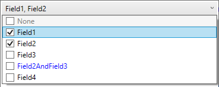

This WPF control allows binding the fields of the [flag](https://docs.microsoft.com/en-us/dotnet/api/system.flagsattribute?view=netcore-3.1) enumeration to the multi-selection combo box.

Create flag enumeration with fields to be bound to the combo box



Bind the View Model property in the XAML to the *Value* dependency property.





Control supports joined values as well as none (0) value. These items will be assigned with blue and gray colors correspondingly.