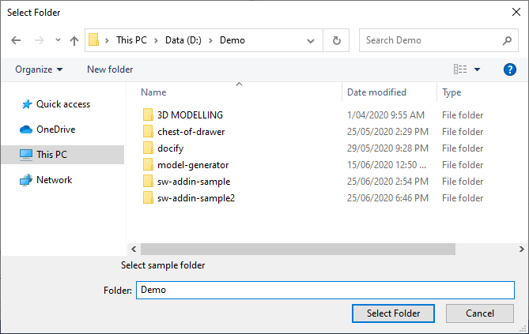
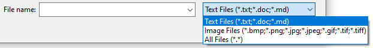

## Browse Folder

Function browses for a folder allowing to optionally specify the caption of the browse dialog



## Browse File

### Filters

Use the function below to build the filters mask or use the predefined filters available



### Open

Shows the file open dialog



### Save

Shows the file save dialog

